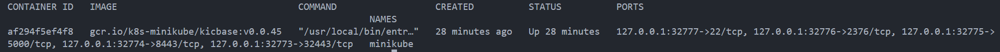
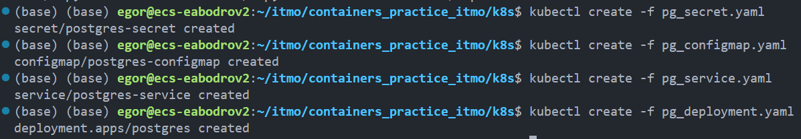
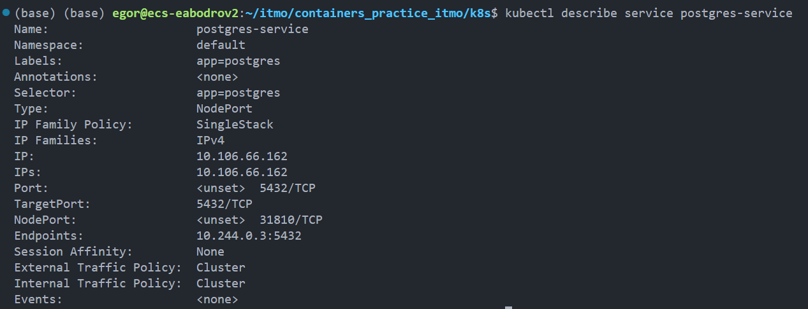
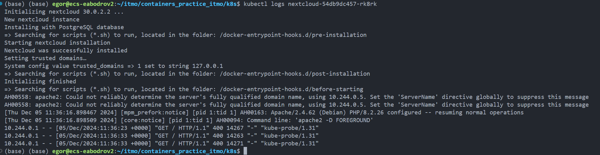
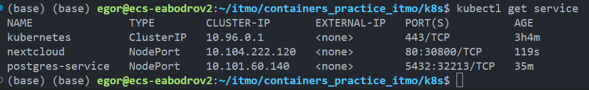

# Lab 3

## TODO

- [x] Развернуть nextcloud + postgresql
- [x] Для постгреса перенести POSTGRES_USER и POSTGRES_PASSWORD из конфигмапы в секреты (очевидно, понадобится
новый манифест для сущности Secret)
- [x] Для некстклауда перенести его переменные ( NEXTCLOUD_UPDATE , ALLOW_EMPTY_PASSWORD и проч.) из деплоймента в
конфигмапу (очевидно, понадобится новый манифест для сущности ConfigMap)
- [x] Для некстклауда добавить Liveness и Readiness пробы
- [x] Ответить на вопросы

## Скрины

**Запуск minikube**

**Убедиться что контейнер minikube поднялся**

**Прогнать манифесты**

**Postgres**

**Запуск nextcloud, логи**

**Список сервисов**

### **ВАЖНО!**

При работе на Ubuntu, согласно [официальной документации](https://minikube.sigs.k8s.io/docs/handbook/accessing/#:~:text=Running%20minikube%20on%20Linux%20with%20the%20Docker%20driver%20will%20result%20in%20no%20tunnel%20being%20created.), не создаются туннели, у меня нет возможности провернуть это на Windows или на другом драйвере, я проверил работоспособность, пингуя localhost внутри контейнера curl'ом.

## Ответы на вопросы

1. 💡 Вопрос: важен ли порядок выполнения этих манифестов? Почему?
> Порядок выполнения манифестов важен. Например, в deployment мы обращаемся к secret сервиса postgres, однако если secret не был создан, то и deployment не сможет получить к ним доступ и корректно выполниться.

2. 💡 Вопрос: что (и почему) произойдет, если отскейлить количество реплик postgres-deployment в 0,
затем обратно в 1, после чего попробовать снова зайти на Nextcloud? 
> Не получится получить доступ к nextcloud, поскольку после выставления реплик в 0 в postgres кубер удалить все инстансы БД, мы потеряем данные, из-за чего при повторном подключении nextcloud будет стучаться туда, где данных нет (никакого резервного копирования не происходит)

# containers_project