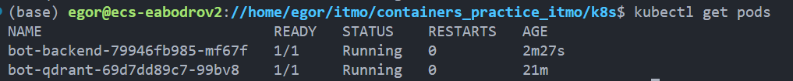
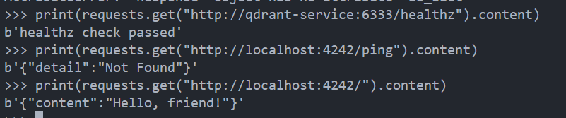

# Lab 4

## TODO

- [x] минимум два Deployment , по количеству сервисов
- [x] кастомный образ для минимум одного Deployment (т.е. не публичный и собранный из своего Dockerfile)
- [x] минимум один Deployment должен содержать в себе контейнер и инит-контейнер
- [x] минимум один Deployment должен содержать volume (любой)
- [x] обязательно использование ConfigMap и/или Secret
- [x] обязательно Service хотя бы для одного из сервисов (что логично, если они работают в связке)
- [x] Liveness и/или Readiness пробы минимум в одном из Deployment
- [x] обязательно использование лейблов (помимо обязательных selector/matchLabel , конечно)

## Running

1. **Сбилдить контейнеры**
```shell
docker build -t qdrant -f docker/qdrant/Dockerfile . 
docker build -t qdrant-init -f docker/qdrant/Dockerfile.init . --build-arg POETRY_VERSION=1.8.3
docker build -t backend -f docker/backend/Dockerfile . --build-arg POETRY_VERSION=1.8.3
```

2. **Перенести их в minikube (предварительно его следует стартануть)**
```shell
minikube start
minikube image load qdrant
minikube image load qdrant-init
minikube image load backend
```

3. **Apply секретов и развертывание qdrant**.
```shell
kubectl apply -f secret.yaml
kubectl apply -f volume.yaml
kubectl apply -f qdrant_service.yaml
kubectl apply -f qdrant_deploy.yaml
```

4. **Развертывание backend**. Тут же запустится инит-контейнер
```shell
kubectl apply -f backend_service.yaml
kubectl apply -f backend_deploy.yaml
```

5. **Скрины**.
> Проверка что поды заработали (у backend два инит-сервиса)



> Проверяем что можем достучаться до endpoint развернутого контейнера с ботом




# containers_project